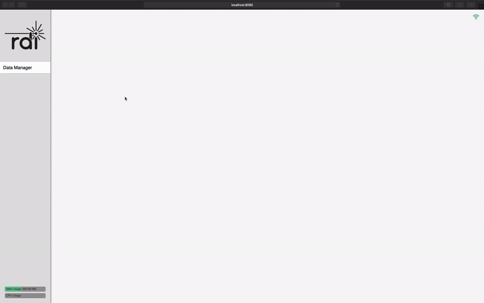
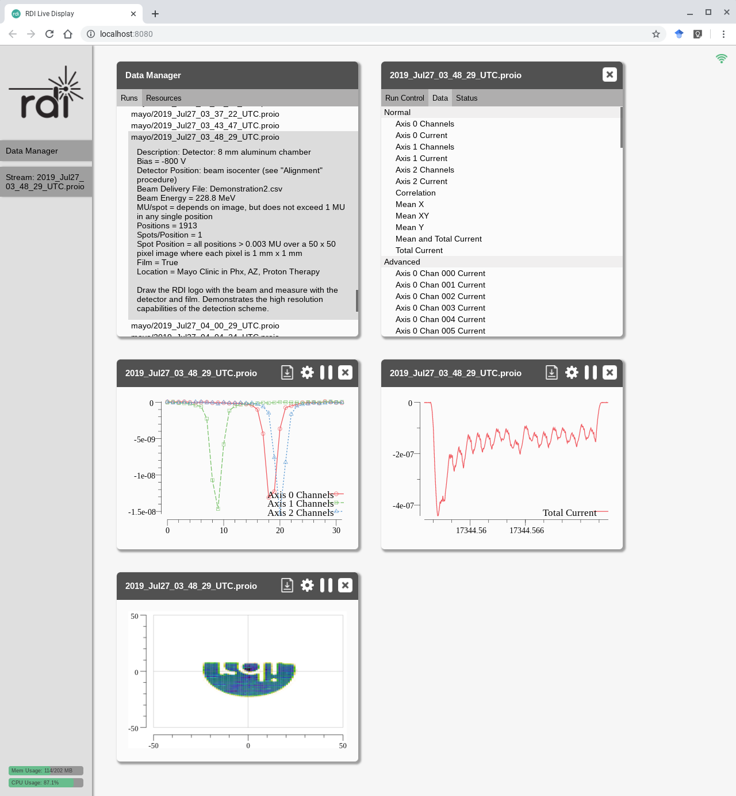

# RDI Live
## Description
RDI Live is a project for live aggregation and display of streaming data.  It
was built as an internal development tool and uses
[proio](https://github.com/proio-org) streams gathered continuously from
radiation detectors.

This material is based upon work supported by the U.S. Department of Energy,
Office of Science, Nuclear Physics program office under Award Number
DE-SC0015136.

## Screenshots



## Tools installation
The tools include the main `rdi-live` binary.
1. Install the Go compiler toolchain (version 1.11 or newer) from
   [https://golang.org/dl/](https://golang.org/dl).
2. `go get` the tools directory recursively
```shell
go get github.com/rditech/rdi-live/tools/...
```

## Protobuf
RDI Live uses Protobuf for (de)serialization of event data.  Additionally,
Protobuf is used to store detector mappings, or metadata that is used to
related data streams to things like physical layout and calibration.  Finally,
Protobuf is used for "slow data", or data that are slowly changing compared to
events, and passed along in the proio streams as stream metadata.  See, e.g.,
[https://godoc.org/github.com/proio-org/go-proio#Reader](https://godoc.org/github.com/proio-org/go-proio#Reader)
and [arXiv:1812.03967](https://arxiv.org/abs/1812.03967)).

The Protobuf files that describe the data models for these data are stored
under the `proto` directory.  Also, Protobuf binaries used for storing detector
mappings are located in the `detmap` directory.  These files are generated
elsewhere.  If changes are made to the Protobuf data model files in `proto`,
the generated source in `model` must be regenerated using `go generate`.  This
requires the `protoc` command to be installed on your system, as well as a go
Protobuf compiler plugin.

## Packr
Executable binaries like `rdi-live` are intended to be completely
self-contained.  To that end, binaries like detector mappings and web data are
packaged into the executables using
[Packr](https://github.com/gobuffalo/packr).  This tool encodes data in certain
directories in this repository into source code that gets compiled into
executables when necessary.  For example, Packr is instructed to pack the web
data into source code
[here](https://github.com/rditech/rdi-live/blob/master/live/webdata.go),
resulting in the autogenerated file
[here](https://github.com/rditech/rdi-live/blob/master/live/a_live-packr.go).
This makes a highly portable executable, but it also means that any time web
data or detector mappings are changed, Packr must be called to regenerate
source code with the new data packed in.  This can be by first installing the
`packr` tool, and then running
```shell
packr -z
```
in the root directory of the repository.
